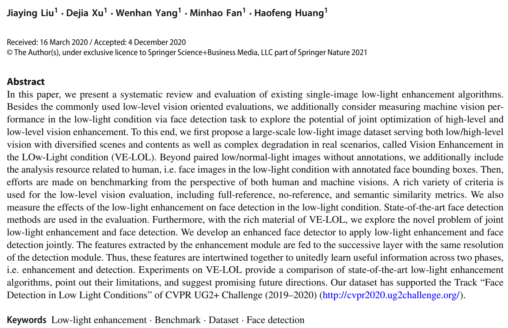
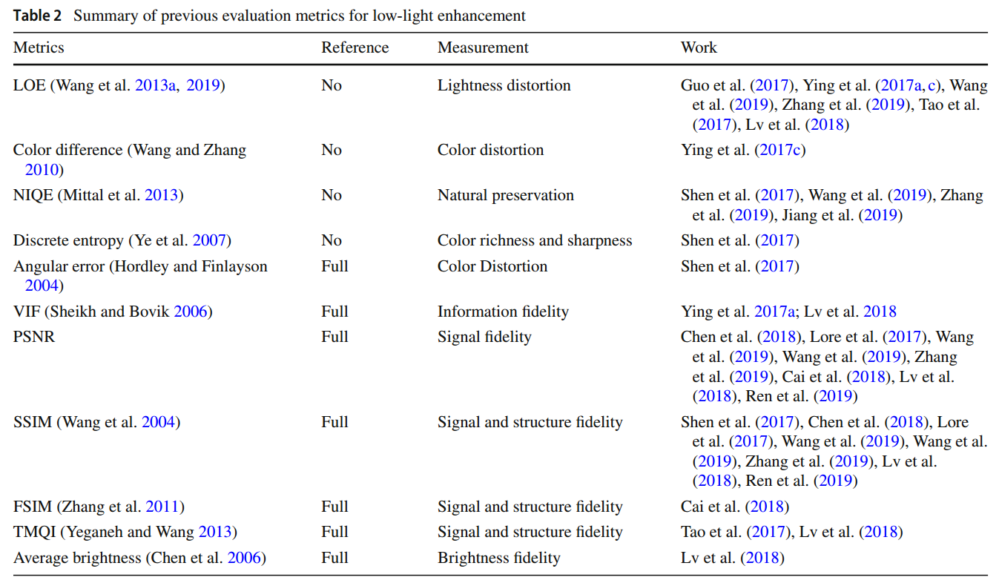
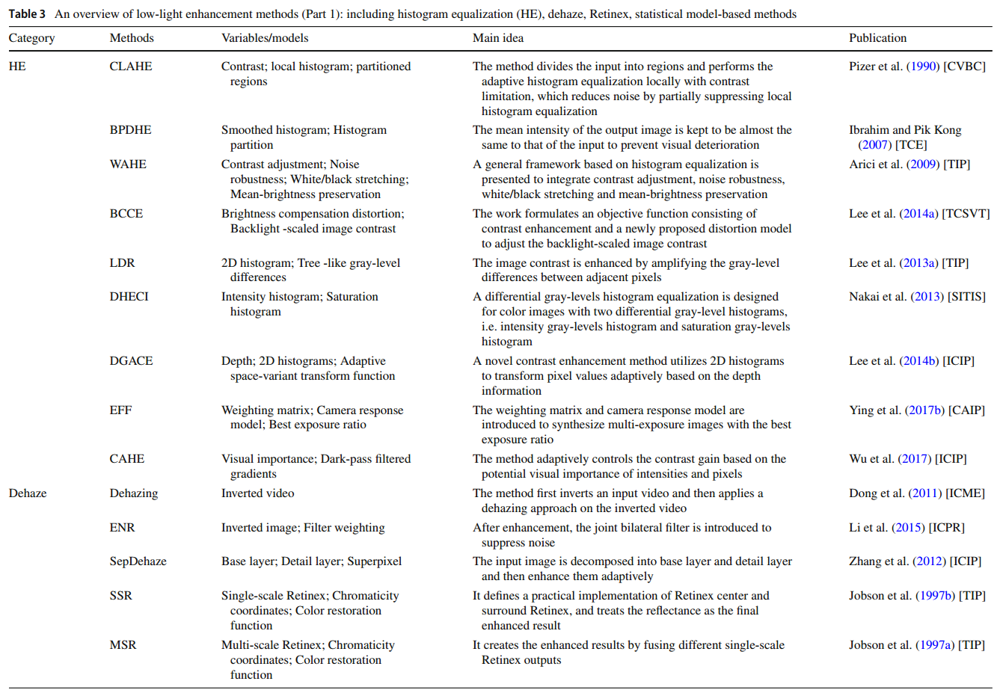
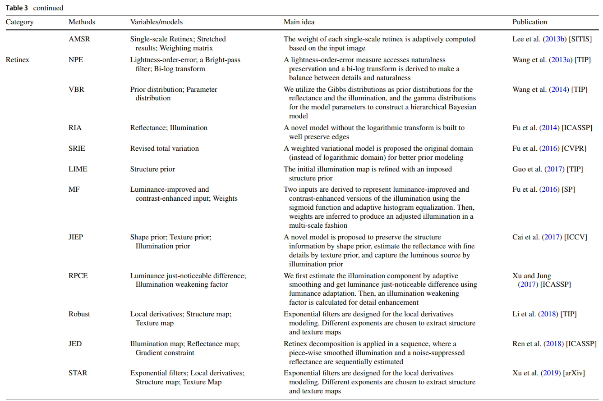
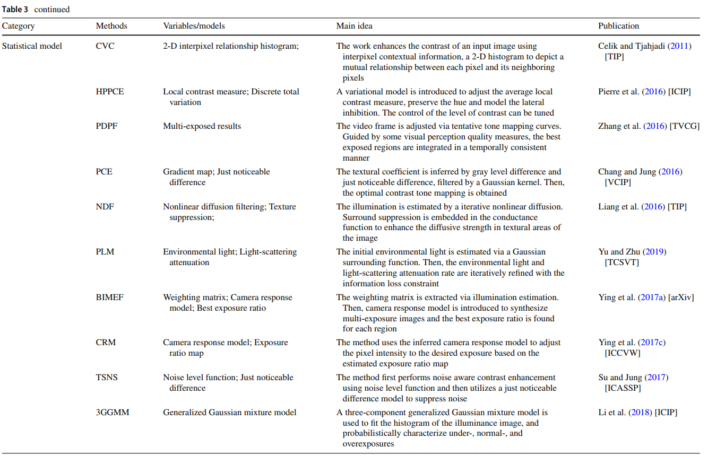
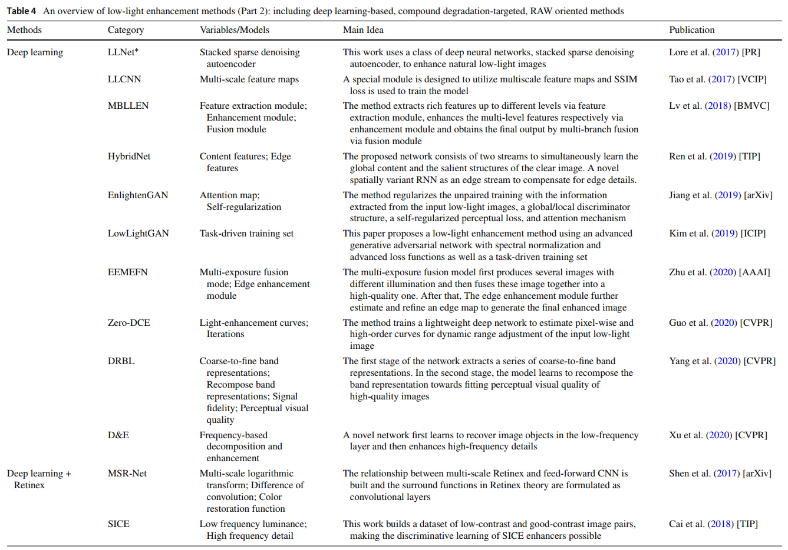
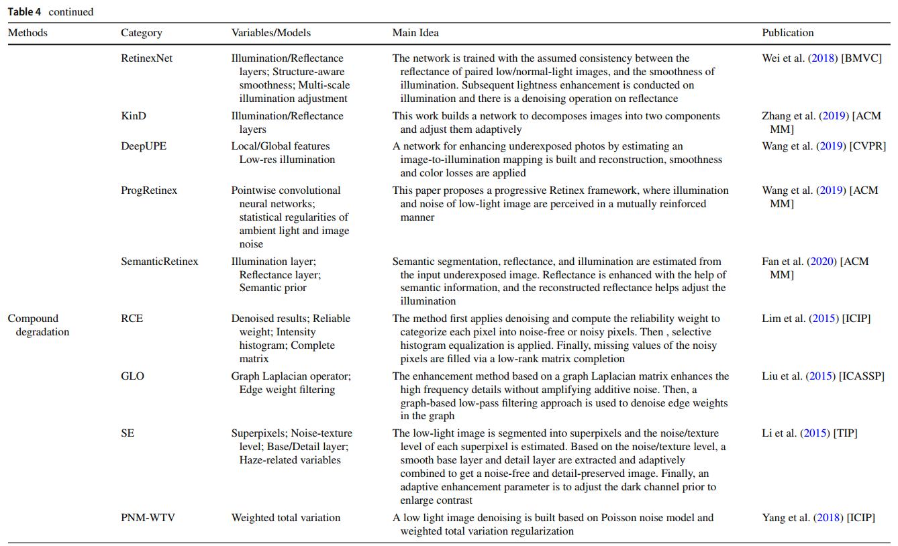
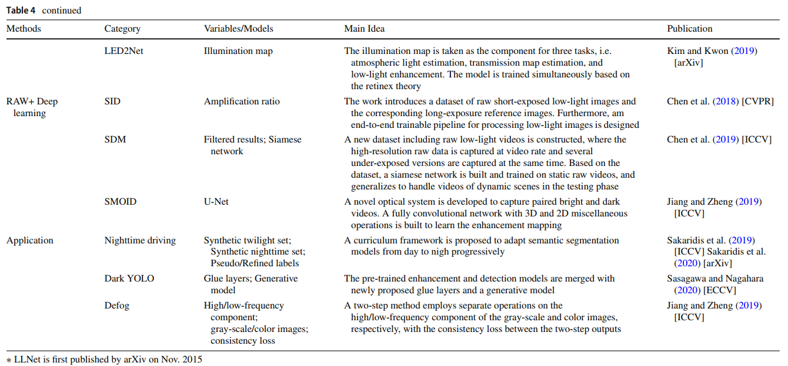
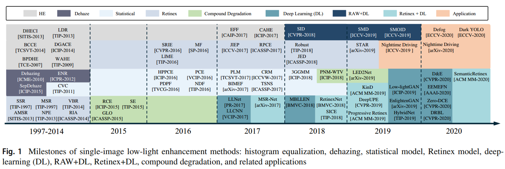

## Benchmarking Low-Light Image Enhancement and Beyond




### **Comparison between existing low-light enhancement datasets and VE-LOL**  


---


### **Summary of previous evaluation metrics for low-light enhancement**



---


### **An overview of low-light enhancement methods**













---


### Milestones of single-image low-light enhancement methods



### Reference

```
[1]J. Liu, D. Xu, W. Yang, M. Fan, and H. Huang, “Benchmarking Low-Light Image Enhancement and Beyond,” Int J Comput Vis, Jan. 2021, doi: 10.1007/s11263-020-01418-8.

```

